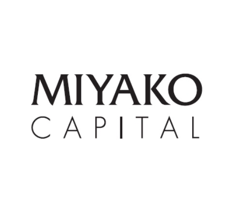

# サポーターの皆様

## 2026年度 ご支援者の皆様

2026年度は、クラウドファンディングサイト「CAMPFIRE」にて 2026年2月9日〜3月23日の期間でご支援を募り、17名の皆様から計 **415,000円** のご支援をいただきました。心より御礼申し上げます。  
[クラウドファンディングのプロジェクトページはこちら](https://camp-fire.jp/projects/913288/view)

  <!-- TODO: 嶋田さんのロゴ(Ante) shimada.png を入手したらロゴ付きカードに差し替える -->
  嶋田和子 様
  

    
    みやこキャピタル 様
  

  馬場啓至 様
  馬場博子 様

藤森陽生 様

## 2025年度 ご支援者の皆様
2025年度、ご支援いただいた方々を紹介します。

  

    
  

  

    
    
xFOREST Therapeutics 田尻健 様

  

その他にも多くの方々からご支援、ご助言を頂きました。皆様のおかげで活動ができたこと、大変嬉しく思います。ありがとうございました。  

2023年度に、学術系クラウドファンディングサイト「academist（アカデミスト）」でご支援いただいた方々をご紹介します。 皆様、本当にありがとうございました。 詳細はこちらからご確認いただけます。  

xFOREST Therapeutics 様  
林オートサービス 様  
Shunichi KASHIDA 様  
Ryo NIWA 様  
S. J. Shimada 様  
海野真司 様  
Yuki Kobayashi 様  
SMNomura 様  
Ken Tajiri 様  
小松リチャード馨 様  
wataru 様  
M Yagyu 様  
「京大当局は吉田寮自治存続を保証すべき」会有志 様  
M. Tokoro 様  
M.O. 様  
徳法寺 様  
ICKW 様  
増本 敬二（東17期） 様  
唐津東11期卒 戸田芳郎 様  
Masahi Tsuda 様  
イカのダンスはすんだのかい 様  
田中千絵 様  
タニグチイチロウ 様  
島添 將誠 様
